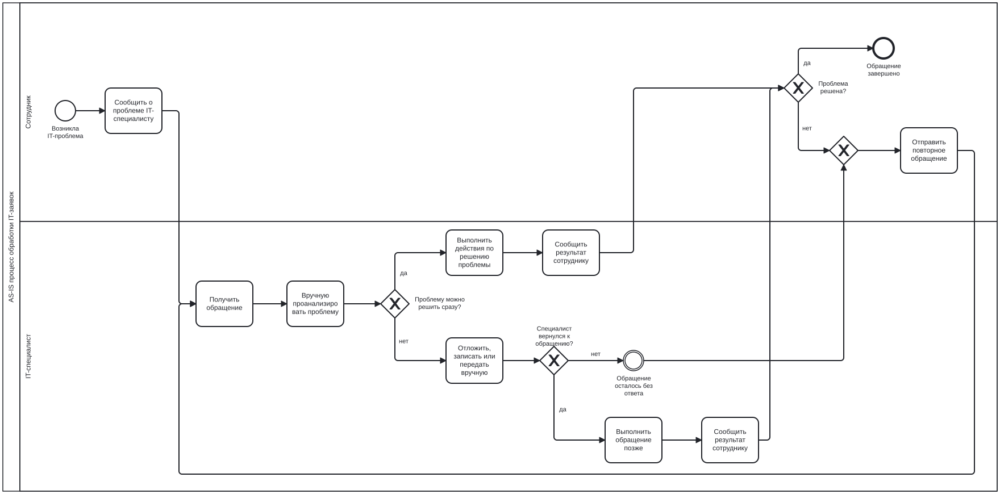

# 03. BPMN AS-IS процесса обработки IT-заявок

## 1. Назначение раздела

Данный раздел содержит BPMN AS-IS модель процесса обработки IT-заявок до внедрения автоматизированной системы.

AS-IS диаграмма нужна для визуального представления текущего процесса: кто участвует в обработке обращения, какие действия выполняются вручную, где возникают развилки и на каких этапах появляются проблемы.

## 2. Цель BPMN AS-IS модели

Цель BPMN AS-IS модели — показать текущий процесс обработки IT-обращений в компании без единой системы регистрации, контроля SLA, учёта статусов и связи с оборудованием.

Диаграмма отражает, что текущий процесс зависит от ручной коммуникации между сотрудником и IT-специалистом. Обращение может быть решено сразу, отложено, передано другому специалисту или потеряно.

## 3. Границы процесса

### Начало процесса

Процесс начинается, когда сотрудник компании сталкивается с IT-проблемой.

Примеры IT-проблем:

* не работает оборудование;
* не открывается программа;
* нет доступа к системе;
* возникла ошибка в 1С;
* не работает принтер;
* требуется настройка рабочего места.

### Конец процесса

Процесс может завершиться несколькими способами:

1. проблема решена, сотрудник получил результат;
2. обращение отложено и выполнено позже;
3. обращение потеряно или забыто;
4. сотрудник вынужден обратиться повторно.

## 4. Участники процесса

В AS-IS процессе участвуют два основных участника.

### 4.1. Сотрудник компании

Сотрудник инициирует обращение, когда сталкивается с IT-проблемой.

Основные действия сотрудника:

* обнаруживает проблему;
* обращается к IT-специалисту;
* ожидает решения;
* получает или не получает результат;
* при необходимости обращается повторно.

### 4.2. IT-специалист

IT-специалист получает обращение и вручную принимает решение о дальнейших действиях.

Основные действия IT-специалиста:

* получает обращение;
* анализирует проблему;
* решает проблему сразу или откладывает;
* может передать обращение другому специалисту;
* может зафиксировать задачу в личных заметках;
* сообщает или не сообщает сотруднику о результате.

## 5. Используемые элементы BPMN

В модели используются следующие элементы BPMN:

| Элемент           | Назначение в модели                                          |
| ----------------- | ------------------------------------------------------------ |
| Start Event       | начало процесса при возникновении IT-проблемы                |
| Task              | действие сотрудника или IT-специалиста                       |
| Exclusive Gateway | развилка, где выбирается один из вариантов развития процесса |
| End Event         | завершение процесса                                          |
| Lane              | разделение действий между сотрудником и IT-специалистом      |
| Sequence Flow     | последовательность выполнения действий                       |

## 6. BPMN AS-IS диаграмма

## 7. Основной поток процесса

Основной поток AS-IS процесса:

1. Сотрудник сталкивается с IT-проблемой.
2. Сотрудник обращается к IT-специалисту через мессенджер, телефон, электронную почту или устно.
3. IT-специалист получает обращение.
4. IT-специалист вручную анализирует проблему.
5. IT-специалист определяет, можно ли решить проблему сразу.
6. Если проблему можно решить сразу, специалист выполняет необходимые действия.
7. Специалист сообщает сотруднику о результате.
8. Сотрудник проверяет, решена ли проблема.
9. Если проблема решена, обращение завершается.

## 8. Альтернативные потоки процесса

### 8.1. Проблему нельзя решить сразу

Если проблему нельзя решить сразу, IT-специалист может отложить обращение, записать его в личные заметки или запомнить.

Недостаток: обращение не фиксируется в единой системе, поэтому срок выполнения не контролируется.

### 8.2. Обращение передаётся другому специалисту

Если специалист не может решить проблему самостоятельно, он может передать обращение другому специалисту вручную.

Недостаток: ответственность за выполнение обращения может стать неочевидной.

### 8.3. Обращение забывается

Если обращение не было зафиксировано, специалист может забыть о нём.

Недостаток: сотрудник вынужден напоминать о проблеме или обращаться повторно.

### 8.4. Проблема не решена после выполнения действий

Если сотрудник получил результат, но проблема не решена, он повторно обращается в IT-отдел.

Недостаток: повторное обращение не связывается с предыдущим, поэтому история проблемы не сохраняется.

## 9. Проблемные места, выявленные на BPMN AS-IS

На AS-IS диаграмме отражены следующие проблемные места:

1. нет единой регистрации обращения;
2. отсутствует формальное назначение исполнителя;
3. нет статуса заявки;
4. срок реакции не фиксируется;
5. срок решения не фиксируется;
6. обращение может быть потеряно;
7. повторные обращения не связываются с предыдущими;
8. руководитель не участвует в контроле процесса;
9. оборудование не учитывается централизованно;
10. нет данных для отчётности.

## 10. Вывод

BPMN AS-IS модель показывает, что текущий процесс обработки IT-заявок является неформальным и зависит от ручной коммуникации между сотрудником и IT-специалистом.

Основные недостатки процесса связаны с отсутствием единого реестра заявок, контроля статусов, ответственных исполнителей, сроков выполнения, истории обращений и централизованного учёта оборудования.

Данная модель является основой для проектирования TO-BE процесса, в котором обработка заявок будет выполняться через 1С Service Desk.
