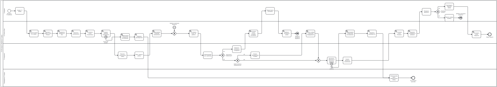

# 05. BPMN TO-BE процесса обработки IT-заявок

## 1. Назначение раздела

Данный раздел содержит описание BPMN TO-BE модели процесса обработки IT-заявок после внедрения системы «1С Service Desk».

TO-BE диаграмма нужна для визуального представления целевого процесса: как сотрудник создаёт заявку, как система регистрирует обращение, как назначается исполнитель, как контролируются статусы и SLA, как фиксируется результат выполнения и как заявка закрывается.

## 2. Цель BPMN TO-BE модели

Цель BPMN TO-BE модели — показать, как должен работать процесс обработки IT-заявок после автоматизации.

Диаграмма должна отразить:

1. централизованное создание IT-заявки в системе;
2. автоматическую регистрацию заявки;
3. присвоение номера и начального статуса;
4. определение приоритета и сроков SLA;
5. назначение исполнителя;
6. фиксацию реакции исполнителя;
7. обработку заявки IT-специалистом;
8. запрос уточнения при недостатке информации;
9. фиксацию результата выполнения;
10. проверку результата сотрудником;
11. закрытие заявки;
12. возврат заявки в работу, если проблема не решена;
13. фиксацию нарушения SLA;
14. контроль просроченных заявок руководителем IT-отдела.

## 3. Границы процесса

### Начало процесса

Процесс начинается, когда сотрудник компании сталкивается с IT-проблемой и создаёт заявку в системе «1С Service Desk».

### Конец процесса

Процесс завершается, когда проблема решена, сотрудник подтвердил результат, а система перевела заявку в статус «Закрыта».

Также возможен возврат заявки в работу, если сотрудник проверил результат и проблема не была решена.

## 4. Участники процесса

В TO-BE процессе участвуют следующие участники.

### 4.1. Сотрудник

Сотрудник является заявителем. Он создаёт IT-заявку, указывает описание проблемы, при необходимости добавляет информацию об оборудовании, проверяет результат выполнения и подтверждает закрытие заявки.

### 4.2. 1С Service Desk

1С Service Desk является информационной системой, которая обеспечивает регистрацию заявки, хранение статусов, расчёт SLA, фиксацию истории изменений, контроль просрочек и передачу данных для отчётности.

### 4.3. IT-специалист

IT-специалист является исполнителем заявки. Он получает назначенное обращение, берёт его в работу, анализирует проблему, запрашивает уточнения, выполняет действия по решению проблемы и фиксирует результат.

### 4.4. Руководитель IT-отдела

Руководитель IT-отдела контролирует просроченные заявки, нарушения SLA и работу исполнителей.

## 5. BPMN TO-BE диаграмма

## 6. Основной поток процесса

Основной поток TO-BE процесса:

1. Сотрудник сталкивается с IT-проблемой.
2. Сотрудник создаёт IT-заявку в системе «1С Service Desk».
3. Система регистрирует заявку.
4. Система присваивает заявке номер.
5. Система устанавливает начальный статус «Новая».
6. Система определяет приоритет заявки.
7. Система рассчитывает срок реакции и срок решения по правилам SLA.
8. Система назначает исполнителя.
9. Система устанавливает статус «Назначена».
10. IT-специалист получает назначенную заявку.
11. IT-специалист берёт заявку в работу.
12. Система фиксирует факт реакции исполнителя.
13. Система устанавливает статус «В работе».
14. IT-специалист анализирует проблему.
15. Если информации достаточно, IT-специалист выполняет действия по решению проблемы.
16. IT-специалист указывает результат выполнения.
17. Система устанавливает статус «Решена».
18. Сотрудник проверяет результат.
19. Если проблема решена, сотрудник подтверждает закрытие заявки.
20. Система устанавливает статус «Закрыта».
21. Процесс завершается.

## 7. Альтернативные потоки

### 7.1. Недостаточно информации по заявке

Если IT-специалисту недостаточно информации для обработки заявки, он запрашивает уточнение у сотрудника.

После этого система переводит заявку в статус «Ожидает уточнения». Сотрудник добавляет недостающую информацию, после чего заявка возвращается к IT-специалисту для продолжения обработки.

### 7.2. Проблема не решена

Если сотрудник проверил результат и проблема не решена, заявка не закрывается.

В этом случае сотрудник возвращает заявку в работу. Система переводит заявку обратно в статус «В работе», а IT-специалист продолжает обработку.

### 7.3. Нарушен срок SLA

Если срок реакции или срок решения нарушен, система фиксирует нарушение SLA.

После фиксации нарушения система уведомляет руководителя IT-отдела. Руководитель контролирует просроченную заявку и при необходимости принимает решение о перераспределении нагрузки или ускорении обработки.

### 7.4. Заявка связана с оборудованием

Если проблема связана с конкретным оборудованием, сотрудник или IT-специалист указывает устройство в заявке.

Система связывает заявку с карточкой оборудования. Это позволяет в дальнейшем анализировать историю обращений и ремонтов по конкретному устройству.

## 8. Используемые элементы BPMN

В TO-BE модели используются следующие элементы BPMN:

| Элемент | Назначение в модели |
|---|---|
| Start Event | начало процесса при возникновении IT-проблемы |
| Task | действие сотрудника, системы, IT-специалиста или руководителя |
| Exclusive Gateway | выбор одного из вариантов процесса |
| Intermediate Event | событие в процессе, например нарушение SLA |
| End Event | завершение процесса после закрытия заявки |
| Lane | разделение действий между участниками процесса |
| Sequence Flow | последовательность выполнения действий |

## 9. Основные статусы заявки в TO-BE процессе

В рамках TO-BE процесса используются следующие статусы заявки:

| Статус | Значение |
|---|---|
| Новая | заявка создана и зарегистрирована в системе |
| Назначена | заявке назначен исполнитель |
| В работе | исполнитель начал обработку заявки |
| Ожидает уточнения | исполнитель запросил дополнительную информацию |
| Решена | исполнитель указал результат выполнения |
| Закрыта | сотрудник подтвердил решение проблемы |
| Просрочена | срок реакции или решения нарушен |

## 10. Как TO-BE диаграмма устраняет проблемы AS-IS

| Проблема AS-IS | Элемент TO-BE диаграммы |
|---|---|
| Обращения теряются | создание заявки в 1С Service Desk |
| Нет единого реестра | регистрация заявки в системе |
| Нет статуса | установка статусов заявки |
| Непонятен исполнитель | назначение исполнителя |
| Нет контроля сроков | расчёт и контроль SLA |
| Нет истории изменений | фиксация изменений по заявке |
| Сотрудник не понимает результат | проверка результата сотрудником |
| Руководитель не видит просрочки | уведомление руководителя о нарушении SLA |
| Нет связи с оборудованием | указание оборудования в заявке |

## 11. Вывод

BPMN TO-BE модель показывает целевой процесс обработки IT-заявок после внедрения системы «1С Service Desk».

В отличие от AS-IS процесса, целевой процесс предусматривает централизованную регистрацию заявок, назначение исполнителей, контроль статусов, расчёт SLA, фиксацию истории изменений, обработку уточнений, возврат заявки в работу и контроль просроченных обращений руководителем IT-отдела.

Данная диаграмма является основой для дальнейшего формирования функциональных требований, бизнес-правил, ER-модели и модели объектов 1С.