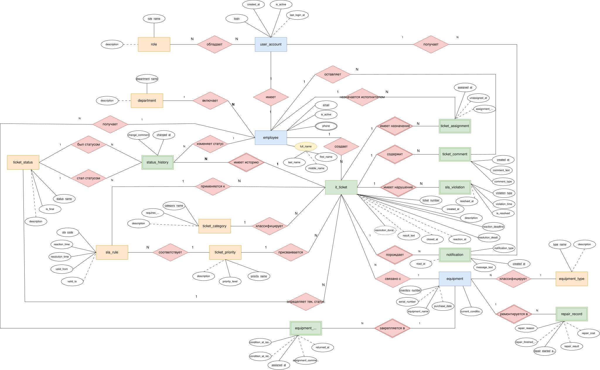

# 11. ER-модель данных

## 1. Назначение раздела

Данный раздел содержит описание концептуальной ER-модели данных системы «1С Service Desk».

ER-модель используется для описания сущностей предметной области, их атрибутов, связей и кардинальностей. Она показывает, какие данные должна хранить система, как эти данные связаны между собой и какие ограничения существуют на уровне предметной области.

Модель построена в нотации Чена. В рамках данной нотации:

- сущности отображаются прямоугольниками;
- слабые сущности отображаются двойными прямоугольниками;
- связи между сущностями отображаются ромбами;
- идентифицирующие связи отображаются двойными ромбами;
- атрибуты отображаются овалами;
- потенциальные ключи выделяются подчёркиванием;
- необязательные атрибуты соединяются с сущностью пунктирной линией;
- производные атрибуты отображаются овалом с пунктирным контуром;
- многозначные атрибуты отображаются двойным овалом.

ER-модель является основой для дальнейшего проектирования объектов 1С: справочников, документов, регистров сведений, ролей и отчётов.

## 2. Общая логика модели

Система «1С Service Desk» предназначена для обработки IT-заявок, контроля SLA и учёта оборудования.

Центральной сущностью модели является `it_ticket`, так как большинство данных системы связано именно с IT-заявкой:

- заявка создаётся сотрудником;
- заявка относится к категории;
- заявке присваивается приоритет;
- по приоритету определяется SLA;
- заявка имеет текущий статус;
- по заявке фиксируется история изменения статусов;
- по заявке могут оставляться комментарии;
- заявка назначается исполнителю;
- по заявке могут фиксироваться нарушения SLA;
- заявка может быть связана с оборудованием;
- по заявке могут формироваться уведомления.

Таким образом, ER-модель отражает не только хранение данных, но и бизнес-логику обработки заявки.

## 3. Классификация сущностей

В модели используются три группы сущностей:

1. справочники;
2. объекты;
3. документы и событийные сущности.

### 3.1. Справочники

Справочники содержат относительно стабильные данные, которые используются для классификации и настройки системы.

| Сущность | Описание |
|---|---|
| `department` | Подразделение сотрудника |
| `role` | Роль пользователя в системе |
| `ticket_category` | Категория IT-заявки |
| `ticket_priority` | Приоритет IT-заявки |
| `ticket_status` | Статус IT-заявки |
| `sla_rule` | Правило SLA |
| `equipment_type` | Тип оборудования |

### 3.2. Объекты

Объекты отражают ключевых участников и предметные объекты системы.

| Сущность | Описание |
|---|---|
| `employee` | Сотрудник компании |
| `user_account` | Учётная запись пользователя |
| `equipment` | Оборудование компании |

### 3.3. Документы и событийные сущности

Документы и событийные сущности фиксируют события, происходящие во времени.

| Сущность | Описание |
|---|---|
| `it_ticket` | IT-заявка сотрудника |
| `ticket_assignment` | Назначение исполнителя на заявку |
| `ticket_comment` | Комментарий или уточнение по заявке |
| `status_history` | История изменения статусов заявки |
| `sla_violation` | Нарушение SLA |
| `notification` | Уведомление пользователя |
| `equipment_assignment` | Закрепление оборудования за сотрудником |
| `repair_record` | Запись о ремонте оборудования |

## 4. Сильные и слабые сущности

### 4.1. Сильные сущности

Сильная сущность может существовать самостоятельно и не зависит полностью от другой сущности.

В модели сильными сущностями являются:

| Сущность | Обоснование |
|---|---|
| `department` | Подразделение существует независимо от конкретной заявки |
| `role` | Роль существует как элемент настройки доступа |
| `employee` | Сотрудник существует независимо от заявок |
| `user_account` | Учётная запись существует как самостоятельный объект доступа |
| `ticket_category` | Категория существует независимо от конкретных заявок |
| `ticket_priority` | Приоритет существует как справочное значение |
| `ticket_status` | Статус существует как справочное значение |
| `sla_rule` | Правило SLA существует как настройка системы |
| `equipment_type` | Тип оборудования существует как справочное значение |
| `equipment` | Оборудование существует независимо от заявок |
| `it_ticket` | Заявка является самостоятельным документом, фиксирующим обращение сотрудника |

### 4.2. Слабые сущности

Слабая сущность не имеет полноценного смысла без родительской сущности.

В модели слабыми сущностями являются:

| Слабая сущность | Родительская сущность | Обоснование |
|---|---|---|
| `ticket_assignment` | `it_ticket` | Назначение исполнителя не существует без заявки |
| `ticket_comment` | `it_ticket` | Комментарий относится к конкретной заявке |
| `status_history` | `it_ticket` | Запись истории статуса относится к конкретной заявке |
| `sla_violation` | `it_ticket` | Нарушение SLA фиксируется по конкретной заявке |
| `notification` | `it_ticket` | Уведомление формируется по событию в заявке |
| `equipment_assignment` | `equipment` | Факт закрепления оборудования не существует без оборудования |
| `repair_record` | `equipment` | Запись о ремонте относится к конкретному оборудованию |

Слабые сущности на диаграмме отображаются двойными прямоугольниками, а идентифицирующие связи с родительскими сущностями — двойными ромбами.

## 5. ER-диаграмма

ER-диаграмма построена в нотации Чена и сохранена в проекте по пути:

```text
diagrams/er_model.drawio.svg
```

В документации диаграмма вставляется следующим образом:

```md

```

## 6. Сущности и атрибуты

### 6.1. `department`

Сущность `department` хранит список подразделений компании.

| Атрибут | Описание | Особенность |
|---|---|---|
| `department_name` | Название подразделения | Потенциальный ключ |
| `description` | Описание подразделения | Необязательный атрибут |

### 6.2. `role`

Сущность `role` хранит список ролей пользователей системы.

| Атрибут | Описание | Особенность |
|---|---|---|
| `role_name` | Название роли | Потенциальный ключ |
| `description` | Описание роли | Необязательный атрибут |

Примеры ролей:

- сотрудник;
- IT-специалист;
- руководитель IT-отдела;
- ответственный за оборудование;
- администратор системы.

### 6.3. `user_account`

Сущность `user_account` хранит данные учётной записи пользователя.

| Атрибут | Описание | Особенность |
|---|---|---|
| `login` | Логин пользователя | Потенциальный ключ |
| `created_at` | Дата создания учётной записи | Обязательный атрибут |
| `is_active` | Признак активности учётной записи | Обязательный атрибут |
| `last_login_at` | Дата последнего входа | Необязательный атрибут |

### 6.4. `employee`

Сущность `employee` хранит данные сотрудников компании.

| Атрибут | Описание | Особенность |
|---|---|---|
| `email` | Корпоративная почта сотрудника | Потенциальный ключ |
| `full_name` | ФИО сотрудника | Составной атрибут |
| `last_name` | Фамилия сотрудника | Часть составного атрибута |
| `first_name` | Имя сотрудника | Часть составного атрибута |
| `middle_name` | Отчество сотрудника | Необязательная часть составного атрибута |
| `phone` | Телефон сотрудника | Многозначный атрибут |
| `is_active` | Признак активности сотрудника | Обязательный атрибут |

Атрибут `full_name` является составным и включает:

```text
last_name
first_name
middle_name
```

Атрибут `phone` является многозначным, так как у сотрудника может быть несколько контактных номеров.

### 6.5. `ticket_category`

Сущность `ticket_category` хранит категории IT-заявок.

| Атрибут | Описание | Особенность |
|---|---|---|
| `category_name` | Название категории | Потенциальный ключ |
| `description` | Описание категории | Необязательный атрибут |
| `requires_equipment` | Признак обязательной связи с оборудованием | Обязательный атрибут |

Примеры категорий:

- проблема с оборудованием;
- проблема с программным обеспечением;
- доступы и учётные записи;
- консультация;
- сетевые проблемы.

### 6.6. `ticket_priority`

Сущность `ticket_priority` хранит приоритеты IT-заявок.

| Атрибут | Описание | Особенность |
|---|---|---|
| `priority_name` | Название приоритета | Потенциальный ключ |
| `priority_level` | Уровень приоритета | Обязательный атрибут |
| `description` | Описание приоритета | Необязательный атрибут |

Примеры приоритетов:

- критический;
- высокий;
- средний;
- низкий.

### 6.7. `ticket_status`

Сущность `ticket_status` хранит возможные статусы IT-заявки.

| Атрибут | Описание | Особенность |
|---|---|---|
| `status_name` | Название статуса | Потенциальный ключ |
| `is_final` | Признак финального статуса | Обязательный атрибут |
| `description` | Описание статуса | Необязательный атрибут |

Примеры статусов:

- новая;
- назначена;
- в работе;
- ожидает уточнения;
- решена;
- закрыта;
- отменена.

### 6.8. `sla_rule`

Сущность `sla_rule` хранит правила SLA.

| Атрибут | Описание | Особенность |
|---|---|---|
| `sla_code` | Код правила SLA | Потенциальный ключ |
| `reaction_time` | Допустимое время реакции | Обязательный атрибут |
| `resolution_time` | Допустимое время решения | Обязательный атрибут |
| `valid_from` | Дата начала действия правила | Обязательный атрибут |
| `valid_to` | Дата окончания действия правила | Необязательный атрибут |

Атрибут `valid_to` является необязательным, так как актуальное правило SLA может не иметь даты окончания.

### 6.9. `it_ticket`

Сущность `it_ticket` является центральной сущностью модели и хранит данные IT-заявки.

| Атрибут | Описание | Особенность |
|---|---|---|
| `ticket_number` | Номер заявки | Потенциальный ключ |
| `created_at` | Дата и время создания заявки | Обязательный атрибут |
| `description` | Описание проблемы | Обязательный атрибут |
| `reaction_deadline` | Срок реакции по SLA | Обязательный атрибут |
| `resolution_deadline` | Срок решения по SLA | Обязательный атрибут |
| `reaction_at` | Дата и время реакции исполнителя | Необязательный атрибут |
| `resolved_at` | Дата и время решения заявки | Необязательный атрибут |
| `closed_at` | Дата и время закрытия заявки | Необязательный атрибут |
| `result_text` | Результат выполнения заявки | Необязательный атрибут |
| `resolution_duration` | Длительность решения заявки | Производный атрибут |

Атрибут `resolution_duration` является производным, так как может быть вычислен на основании даты создания и даты решения заявки:

```text
resolution_duration = resolved_at - created_at
```

### 6.10. `ticket_assignment`

Сущность `ticket_assignment` фиксирует назначение исполнителя на заявку.

| Атрибут | Описание | Особенность |
|---|---|---|
| `assigned_at` | Дата и время назначения исполнителя | Локальный ключ слабой сущности |
| `unassigned_at` | Дата и время снятия назначения | Необязательный атрибут |
| `assignment_comment` | Комментарий к назначению | Необязательный атрибут |

Сущность является слабой, так как назначение исполнителя не существует без конкретной IT-заявки.

### 6.11. `ticket_comment`

Сущность `ticket_comment` хранит комментарии и уточнения по заявке.

| Атрибут | Описание | Особенность |
|---|---|---|
| `created_at` | Дата и время создания комментария | Локальный ключ слабой сущности |
| `comment_text` | Текст комментария | Обязательный атрибут |
| `comment_type` | Тип комментария | Обязательный атрибут |

Примеры типов комментариев:

- комментарий;
- запрос уточнения;
- ответ сотрудника;
- служебная заметка.

### 6.12. `status_history`

Сущность `status_history` хранит историю изменения статусов заявки.

| Атрибут | Описание | Особенность |
|---|---|---|
| `changed_at` | Дата и время изменения статуса | Локальный ключ слабой сущности |
| `change_comment` | Комментарий к изменению статуса | Необязательный атрибут |

Старый и новый статус не добавляются как обычные атрибуты, так как они отражены отдельными связями:

```text
ticket_status — был статусом — status_history
ticket_status — стал статусом — status_history
```

Это позволяет явно показать, что запись истории содержит переход от одного статуса к другому.

### 6.13. `sla_violation`

Сущность `sla_violation` хранит данные о нарушениях SLA.

| Атрибут | Описание | Особенность |
|---|---|---|
| `violation_type` | Тип нарушения SLA | Локальный ключ слабой сущности |
| `violation_time` | Дата и время фиксации нарушения | Обязательный атрибут |
| `is_resolved` | Признак обработки нарушения | Обязательный атрибут |
| `resolved_at` | Дата и время обработки нарушения | Необязательный атрибут |

Примеры типов нарушения:

- нарушение срока реакции;
- нарушение срока решения.

Одна заявка может иметь нарушение SLA реакции, нарушение SLA решения или оба нарушения одновременно.

### 6.14. `notification`

Сущность `notification` хранит уведомления пользователей.

| Атрибут | Описание | Особенность |
|---|---|---|
| `notification_type` | Тип уведомления | Обязательный атрибут |
| `created_at` | Дата и время создания уведомления | Локальный ключ слабой сущности |
| `message_text` | Текст уведомления | Обязательный атрибут |
| `read_at` | Дата и время прочтения уведомления | Необязательный атрибут |

Примеры уведомлений:

- назначение заявки исполнителю;
- запрос уточнения;
- решение заявки;
- нарушение SLA;
- возврат заявки в работу.

### 6.15. `equipment_type`

Сущность `equipment_type` хранит типы оборудования.

| Атрибут | Описание | Особенность |
|---|---|---|
| `type_name` | Название типа оборудования | Потенциальный ключ |
| `description` | Описание типа оборудования | Необязательный атрибут |

Примеры типов оборудования:

- ноутбук;
- монитор;
- принтер;
- системный блок;
- телефон.

### 6.16. `equipment`

Сущность `equipment` хранит данные об оборудовании компании.

| Атрибут | Описание | Особенность |
|---|---|---|
| `inventory_number` | Инвентарный номер оборудования | Потенциальный ключ |
| `serial_number` | Серийный номер оборудования | Необязательный атрибут |
| `equipment_name` | Наименование оборудования | Обязательный атрибут |
| `purchase_date` | Дата приобретения оборудования | Необязательный атрибут |
| `current_condition` | Текущее состояние оборудования | Обязательный атрибут |

### 6.17. `equipment_assignment`

Сущность `equipment_assignment` фиксирует факт закрепления оборудования за сотрудником.

| Атрибут | Описание | Особенность |
|---|---|---|
| `assigned_at` | Дата и время закрепления оборудования | Локальный ключ слабой сущности |
| `returned_at` | Дата и время возврата оборудования | Необязательный атрибут |
| `condition_at_issue` | Состояние оборудования при выдаче | Обязательный атрибут |
| `condition_at_return` | Состояние оборудования при возврате | Необязательный атрибут |
| `assignment_comment` | Комментарий к закреплению | Необязательный атрибут |

Сущность является слабой относительно `equipment`, так как факт закрепления не существует без конкретной единицы оборудования.

### 6.18. `repair_record`

Сущность `repair_record` хранит записи о ремонте оборудования.

| Атрибут | Описание | Особенность |
|---|---|---|
| `repair_started_at` | Дата начала ремонта | Локальный ключ слабой сущности |
| `repair_finished_at` | Дата завершения ремонта | Необязательный атрибут |
| `repair_reason` | Причина ремонта | Обязательный атрибут |
| `repair_result` | Результат ремонта | Необязательный атрибут |
| `repair_cost` | Стоимость ремонта | Необязательный атрибут |

Сущность является слабой относительно `equipment`, так как запись о ремонте относится к конкретному оборудованию.

## 7. Связи между сущностями

### 7.1. Организационная структура и пользователи

| Сущность 1 | Кардинальность | Связь | Кардинальность | Сущность 2 | Обоснование |
|---|---:|---|---:|---|---|
| `department` | 1 | включает | N | `employee` | Одно подразделение включает много сотрудников |
| `employee` | 1 | имеет | 1 | `user_account` | Один сотрудник имеет одну учётную запись |
| `user_account` | N | обладает | N | `role` | Один пользователь может иметь несколько ролей, одна роль может быть у многих пользователей |

### 7.2. Создание и классификация заявки

| Сущность 1 | Кардинальность | Связь | Кардинальность | Сущность 2 | Обоснование |
|---|---:|---|---:|---|---|
| `employee` | 1 | создаёт | N | `it_ticket` | Один сотрудник может создать много заявок |
| `ticket_category` | 1 | классифицирует | N | `it_ticket` | Одна категория может использоваться во многих заявках |
| `ticket_priority` | 1 | присваивается | N | `it_ticket` | Один приоритет может быть присвоен многим заявкам |
| `ticket_status` | 1 | определяет текущий статус | N | `it_ticket` | Один статус может быть текущим для многих заявок |

### 7.3. SLA

| Сущность 1 | Кардинальность | Связь | Кардинальность | Сущность 2 | Обоснование |
|---|---:|---|---:|---|---|
| `ticket_priority` | 1 | соответствует | N | `sla_rule` | Один приоритет может иметь несколько правил SLA в разные периоды |
| `sla_rule` | 1 | применяется к | N | `it_ticket` | Одно правило SLA может применяться ко многим заявкам |
| `it_ticket` | 1 | имеет нарушение | N | `sla_violation` | Одна заявка может иметь несколько нарушений SLA |

### 7.4. Назначение исполнителя

| Сущность 1 | Кардинальность | Связь | Кардинальность | Сущность 2 | Обоснование |
|---|---:|---|---:|---|---|
| `it_ticket` | 1 | имеет назначение | N | `ticket_assignment` | Одна заявка может иметь несколько назначений исполнителя |
| `employee` | 1 | назначается исполнителем | N | `ticket_assignment` | Один сотрудник может быть исполнителем во многих назначениях |

### 7.5. Комментарии и уточнения

| Сущность 1 | Кардинальность | Связь | Кардинальность | Сущность 2 | Обоснование |
|---|---:|---|---:|---|---|
| `it_ticket` | 1 | содержит | N | `ticket_comment` | Одна заявка может содержать много комментариев |
| `employee` | 1 | оставляет | N | `ticket_comment` | Один сотрудник может оставить много комментариев |

### 7.6. История изменения статусов

| Сущность 1 | Кардинальность | Связь | Кардинальность | Сущность 2 | Обоснование |
|---|---:|---|---:|---|---|
| `it_ticket` | 1 | имеет историю | N | `status_history` | Одна заявка имеет много записей истории статусов |
| `employee` | 1 | изменяет статус | N | `status_history` | Один сотрудник может выполнить много изменений статуса |
| `ticket_status` | 1 | был статусом | N | `status_history` | Один статус может быть старым статусом во многих записях истории |
| `ticket_status` | 1 | стал статусом | N | `status_history` | Один статус может быть новым статусом во многих записях истории |

### 7.7. Уведомления

| Сущность 1 | Кардинальность | Связь | Кардинальность | Сущность 2 | Обоснование |
|---|---:|---|---:|---|---|
| `it_ticket` | 1 | порождает | N | `notification` | Одна заявка может породить много уведомлений |
| `user_account` | 1 | получает | N | `notification` | Один пользователь может получить много уведомлений |

### 7.8. Оборудование

| Сущность 1 | Кардинальность | Связь | Кардинальность | Сущность 2 | Обоснование |
|---|---:|---|---:|---|---|
| `equipment_type` | 1 | классифицирует | N | `equipment` | Один тип оборудования включает много единиц оборудования |
| `equipment` | 1 | связано с | N | `it_ticket` | Одно оборудование может быть связано со многими заявками |
| `equipment` | 1 | закрепляется в | N | `equipment_assignment` | Одно оборудование может иметь много фактов закрепления |
| `employee` | 1 | получает | N | `equipment_assignment` | Один сотрудник может получать оборудование много раз |
| `equipment` | 1 | ремонтируется в | N | `repair_record` | Одно оборудование может иметь много записей о ремонте |

## 8. Идентифицирующие связи

Идентифицирующие связи используются между сильной родительской сущностью и слабой зависимой сущностью.

| Родительская сущность | Слабая сущность | Связь |
|---|---|---|
| `it_ticket` | `ticket_assignment` | имеет назначение |
| `it_ticket` | `ticket_comment` | содержит |
| `it_ticket` | `status_history` | имеет историю |
| `it_ticket` | `sla_violation` | имеет нарушение |
| `it_ticket` | `notification` | порождает |
| `equipment` | `equipment_assignment` | закрепляется в |
| `equipment` | `repair_record` | ремонтируется в |

На диаграмме данные связи отображаются двойными ромбами.

## 9. Связь ER-модели с объектами 1С

ER-модель будет использована для проектирования объектов конфигурации 1С.

| ER-сущность | Возможный объект 1С |
|---|---|
| `department` | Справочник «Подразделения» |
| `role` | Роль 1С / справочник ролей проекта |
| `employee` | Справочник «Сотрудники» |
| `user_account` | Пользователи информационной базы / справочник учётных записей |
| `ticket_category` | Справочник «КатегорииЗаявок» |
| `ticket_priority` | Справочник или перечисление «ПриоритетыЗаявок» |
| `ticket_status` | Перечисление или справочник «СтатусыЗаявок» |
| `sla_rule` | Регистр сведений «ПравилаSLA» |
| `it_ticket` | Документ «ITЗаявка» |
| `ticket_assignment` | Регистр сведений «НазначенияИсполнителей» |
| `ticket_comment` | Табличная часть документа или регистр сведений «КомментарииЗаявок» |
| `status_history` | Регистр сведений «ИсторияИзмененияСтатусов» |
| `sla_violation` | Регистр сведений «НарушенияSLA» |
| `notification` | Регистр сведений «УведомленияПользователей» |
| `equipment_type` | Справочник «ТипыОборудования» |
| `equipment` | Справочник «Оборудование» |
| `equipment_assignment` | Документ или регистр сведений «ЗакреплениеОборудования» |
| `repair_record` | Документ или регистр сведений «РемонтОборудования» |

## 10. Связь ER-модели с требованиями

ER-модель связана с ранее описанными функциональными требованиями и бизнес-правилами.

| Блок требований | Отражение в ER-модели |
|---|---|
| Создание заявки | Сущности `employee`, `it_ticket`, `ticket_category`, `ticket_priority` |
| Назначение исполнителя | Сущности `it_ticket`, `employee`, `ticket_assignment` |
| Жизненный цикл статусов | Сущности `ticket_status`, `status_history`, `it_ticket` |
| Контроль SLA | Сущности `sla_rule`, `sla_violation`, `ticket_priority`, `it_ticket` |
| Комментарии и уточнения | Сущности `ticket_comment`, `employee`, `it_ticket` |
| Уведомления | Сущности `notification`, `user_account`, `it_ticket` |
| Учёт оборудования | Сущности `equipment`, `equipment_type`, `equipment_assignment`, `repair_record` |
| Права доступа | Сущности `user_account`, `role`, `employee` |
| Отчётность | Данные заявок, SLA, статусов, исполнителей и оборудования |

## 11. Вывод

ER-модель системы «1С Service Desk» описывает основные данные, необходимые для обработки IT-заявок, контроля SLA и учёта оборудования.

Центральной сущностью модели является `it_ticket`, вокруг которой строятся связи с сотрудниками, категориями, приоритетами, статусами, SLA, комментариями, назначениями, нарушениями, уведомлениями и оборудованием.

Модель построена на концептуальном уровне и не содержит физические детали реализации, такие как типы данных, внешние ключи и технические идентификаторы. Это позволяет использовать её как основу для дальнейшего проектирования объектов 1С, логической модели данных, тест-кейсов и прототипа системы.