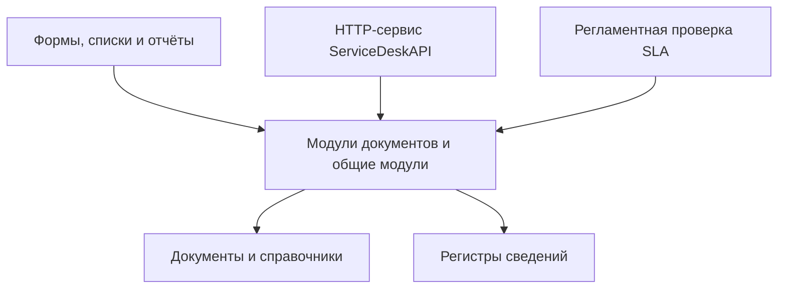
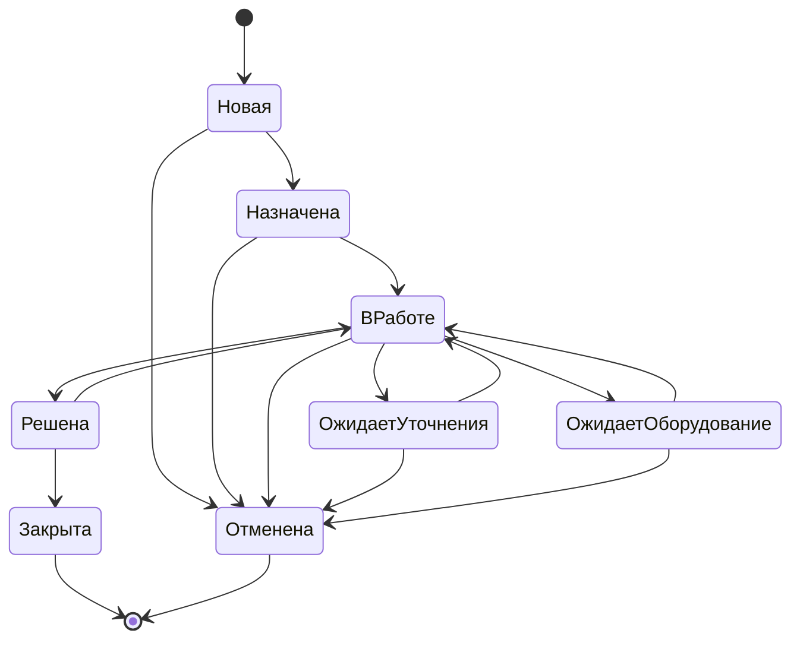

# 12. Архитектура текущей реализации

## 1. Основание документа

Документ описывает фактически выгруженную конфигурацию из каталога `src`. Целевая аналитическая модель в документах 01–11 шире текущей реализации; граница между реализованным и планируемым функционалом отдельно зафиксирована в [статусе проекта](13_project_scope.md).

Конфигурация называется `ServiceDesk`, работает в режиме управляемого приложения и имеет режим совместимости `Version8_3_27`.

## 2. Слои решения



Решение построено на стандартных объектах 1С. В выгруженных модулях нет кода обращения к отдельной внешней базе данных или подключения сторонних библиотек. Прикладная логика находится в модулях объектов, формах и серверных общих модулях.

## 3. Состав конфигурации

| Тип объектов | Фактический состав |
|---|---|
| Подсистемы | `Заявки`, `Оборудование`, `SLA`, `Отчёты`, `Администрирование` |
| Справочники | `Подразделения`, `Сотрудники`, `КатегорииЗаявок`, `ПриоритетыЗаявок`, `ТипыОборудования`, `Оборудование` |
| Документы | `ITЗаявка`, `ЗакреплениеОборудования`, `РемонтОборудования` |
| Перечисления | `СтатусыЗаявок`, `ТипыНарушенийSLA`, `ТипыКомментариев`, `ТипыУведомлений`, `СостоянияОборудования` |
| Регистры сведений | `ПравилаSLA`, `ИсторияИзмененияСтатусов`, `НазначенияИсполнителей`, `НарушенияSLA`, `КомментарииЗаявок`, `УведомленияПользователей`, `ИсторияСостоянийОборудования` |
| Отчёты | `АнализЗаявок`, `КонтрольSLA` |
| Общие модули | `УправлениеSLAСервер`, `УправлениеПользователямиСервер`, `УправлениеУведомлениямиСервер`, `УправлениеУведомлениямиВызовСервера`, `УправлениеКомментариямиСервер`, `УправлениеОборудованиемСервер` |
| Роли | `БазовыеПраваServiceDesk`, `ПользовательСотрудник`, `ИсполнительЗаявок`, `РуководительITОтдела`, `ОтветственныйЗаОборудование`, `АдминистраторСистемы` |
| Интеграция | HTTP-сервис `ServiceDeskAPI` |
| Фоновые операции | Регламентное задание `ПроверкаНарушенийSLA` |

Регистры накопления, объекты `БизнесПроцесс` и `Задача` в текущей выгрузке отсутствуют.

## 4. Документ `ITЗаявка`

Документ хранит заявителя, категорию, приоритет, текущий статус, исполнителя, оборудование, описание проблемы, нормативные и фактические даты, а также результат выполнения.

При создании:

1. устанавливается статус `Новая`;
2. заявитель определяется по имени текущего пользователя информационной базы;
3. проверяются активность найденного сотрудника и однозначность связи;
4. проверяются обязательные поля;
5. по приоритету и дате выбирается правило SLA;
6. рассчитываются сроки реакции и решения.

Для категории с признаком `ТребуетОборудование` можно указать только оборудование, которое находится в состоянии `Используется` и закреплено за заявителем.

## 5. Жизненный цикл заявки



Права на переходы дополнительно проверяются в модуле объекта:

| Действие | Разрешённый участник текущей реализации |
|---|---|
| Назначить заявку | Руководитель IT-отдела или администратор |
| Взять назначенную заявку в работу | Назначенный исполнитель или администратор |
| Перевести в ожидание | Назначенный исполнитель или администратор |
| Вернуть из ожидания уточнения | Назначенный исполнитель или администратор; требуется ответ заявителя |
| Вернуть из ожидания оборудования | Назначенный исполнитель, сотрудник с ролью и признаком ответственного за оборудование либо администратор; требуется завершённая операция |
| Зафиксировать решение | Назначенный исполнитель или администратор |
| Закрыть или вернуть решённую заявку | Руководитель IT-отдела или администратор |
| Отменить заявку | Руководитель IT-отдела или администратор, если переход разрешён из текущего статуса |

История каждого изменения статуса записывается в `ИсторияИзмененияСтатусов`, а изменение исполнителя — в `НазначенияИсполнителей`.

## 6. SLA

`ПравилаSLA` — периодический регистр сведений с измерением `Приоритет`. Правило выбирается через `СрезПоследних` на дату заявки.

```text
СрокРеакции = ДатаЗаявки + СрокРеакцииЧасы × 3600
СрокРешения = ДатаЗаявки + СрокРешенияЧасы × 3600
```

Оба норматива должны быть больше нуля. Расчёт использует календарные часы; рабочий календарь и остановка SLA на статусах ожидания не реализованы.

Фактические даты:

- `ДатаРеакции` заполняется при первом переходе `Назначена` → `ВРаботе`;
- `ДатаРешения` заполняется при переходе `ВРаботе` → `Решена` и очищается при возврате из `Решена` в `ВРаботе`;
- `ДатаЗакрытия` заполняется при переходе `Решена` → `Закрыта`.

Нарушения срока реакции и срока решения записываются в `НарушенияSLA` без дублирования одной пары «заявка + тип нарушения». Проверку можно вызвать из формы списка либо регламентным заданием с периодом 300 секунд.

Отчёт `КонтрольSLA` получает первую фактическую реакцию и первое решение из истории статусов, соединяет их с зарегистрированными нарушениями и выводит результат `В срок`, `Нарушено`, `Не зафиксирована`, `Не решена`, `Не применяется` или `Срок не рассчитан`.

## 7. Комментарии и уведомления

Комментарии хранятся в регистре `КомментарииЗаявок`. Тип и доступность комментария зависят от роли пользователя, его связи с заявкой и текущего статуса.

Обязательные комментарии для переходов:

| Переход | Тип комментария |
|---|---|
| `ВРаботе` → `ОжидаетУточнения` | `ЗапросУточнения` |
| `ОжидаетУточнения` → `ВРаботе` | `ОтветСотрудника` |
| `Решена` → `ВРаботе` | `ПричинаВозврата` |

Уведомления создаются при назначении, запросе и получении уточнения, решении, возврате в работу и необходимости операции с оборудованием. Управляемое приложение проверяет новые уведомления при запуске и затем каждые 60 секунд.

Для нарушений SLA в перечислении существуют отдельные типы уведомлений, а модуль обработки умеет закрывать соответствующие уведомления. Однако вызов создания уведомления в момент регистрации нарушения в текущем модуле не найден, поэтому этот сценарий не считается реализованным полностью.

## 8. Оборудование

Источник фактического состояния — периодический регистр `ИсторияСостоянийОборудования`. Если история отсутствует, серверная функция возвращает состояние `НаСкладе` и пустого ответственного.

### 8.1. Выдача

Документ `ЗакреплениеОборудования` проводится только по заявке в статусе `ОжидаетОборудование`. Выдаваемая единица должна находиться на складе, получателем должен быть заявитель, а проблемное оборудование из заявки нельзя выдать повторно. Проведение записывает состояние `Используется` и сотрудника, за которым закреплено оборудование.

### 8.2. Ремонт

Документ `РемонтОборудования` принимает только проблемное оборудование из заявки, находящееся в состоянии `Используется` и закреплённое за заявителем. Начало ремонта записывает состояние `ВРемонте` и очищает ответственного.

При заполненной дате окончания обязательны результат и состояние после ремонта. После завершения нельзя оставить состояние `ВРемонте`; допустимы остальные значения перечисления, включая `Списано`. Выбранное значение записывается в историю. Ответственный восстанавливается только при результате `Используется`, для `НаСкладе` и `Списано` он остаётся пустым.

Возврат заявки из `ОжидаетОборудование` в `ВРаботе` требует, чтобы последняя запись хотя бы по одной операции этой заявки имела состояние `Используется`. Поэтому после списания проблемного устройства продолжение обеспечивается выдачей замены по той же заявке.

## 9. HTTP API и отчёты

Контракт и фактический статус проверки HTTP-методов описаны в [документации API](15_http_api.md).

`АнализЗаявок` выводит заявки за выбранный период, группирует их по статусам и поддерживает отборы по статусу, категории, исполнителю и заявителю. `КонтрольSLA` показывает нормативные и фактические даты реакции и решения с условным оформлением результатов.

## 10. Контроль доступа

Ролевые ограничения реализованы в двух слоях:

1. права метаданных ролей на объекты конфигурации;
2. проверки ролей, текущего сотрудника и связи сотрудника с заявкой в модулях и формах.

Списки заявок фильтруются в форме: сотрудник видит свои заявки, исполнитель — назначенные ему, ответственный за оборудование — заявки в статусе `ОжидаетОборудование`; руководитель и администратор получают список без этого фиксированного отбора.

Это прикладные отборы формы, а не ограничения доступа к строкам на уровне записей. Текущие ограничения и несоответствия прав описаны в [статусе проекта](13_project_scope.md).
